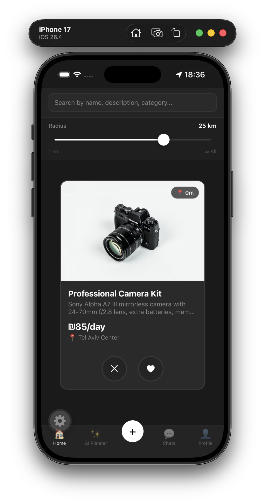
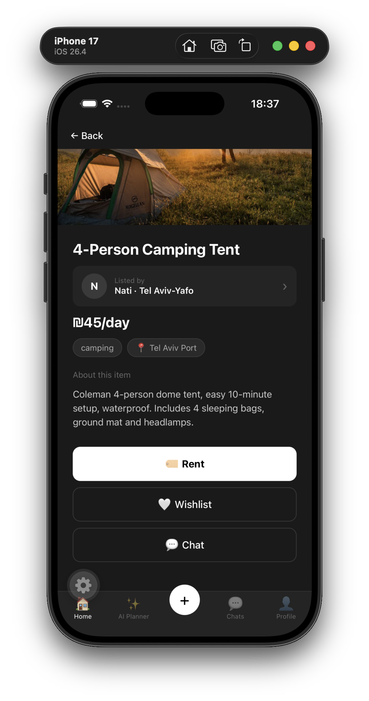
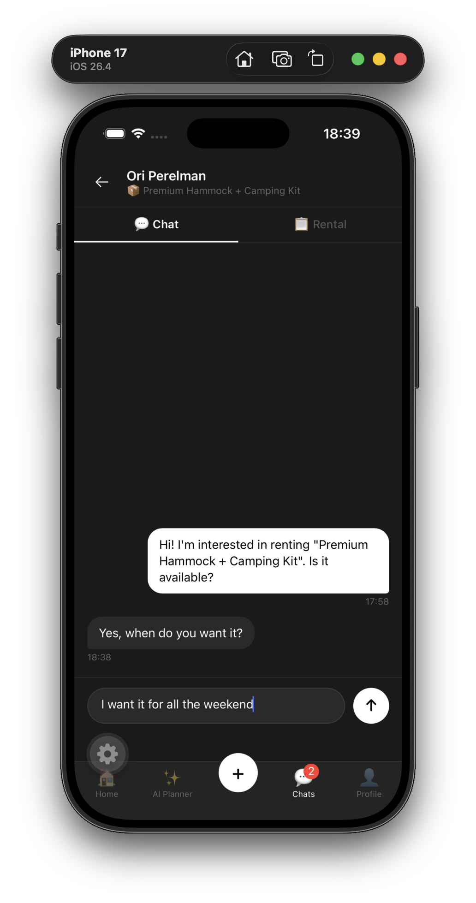
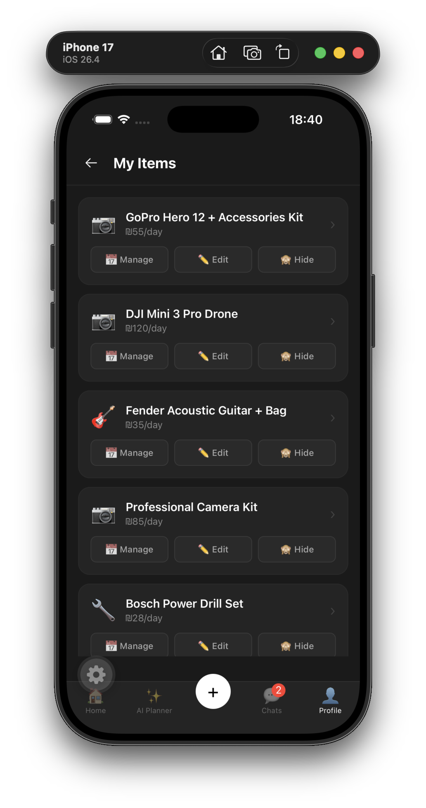

<div align="center">


# SwipeAndRent

**A P2P rental marketplace — swipe to discover nearby gear, rent it securely, and verify every handoff with a QR code.**

[](https://reactnative.dev/)
[](https://expo.dev/)
[](https://supabase.com/)
[](https://www.typescriptlang.org/)
[](https://stripe.com/)

</div>

---

## Overview

SwipeAndRent connects people who own equipment with people who need it — locally, securely, and without middlemen. Browse items by swiping through a location-aware feed, send a rental request, pay through an escrow-protected flow, and confirm every pickup and return with a unique QR code.

Built as a cross-platform mobile app (iOS + Android) using React Native and Expo, with Supabase handling auth, database, real-time messaging, and file storage.

---

## Features

|   | Feature | Description |
|---|---|---|
| 📍 | **Location-based Feed** | Swipe through items sorted by distance from your location |
| 💬 | **Real-time Chat** | Message lenders directly; rental requests flow through the chat |
| 🔐 | **Escrow Payments** | Funds held securely and released only after confirmed return |
| 📷 | **QR Transfer Verification** | Unique QR per transaction — scanned on pickup and return |
| 🤖 | **AI Smart Search** | Groq-powered agent that finds items matching a free-text query |
| ❤️ | **Wishlist** | Save items and come back to them later |
| 🗓️ | **Availability Calendar** | Request specific dates; conflicts are blocked automatically |
| 🛡️ | **Verified Listings** | Items go through a verification flow before going live |

---

## Tech Stack

| Layer | Technology |
|---|---|
| Mobile | React Native + Expo (iOS & Android) |
| Auth & Database | Supabase (PostgreSQL + Row-Level Security) |
| Real-time Messaging | Supabase Realtime |
| File Storage | Supabase Storage |
| Payments | Stripe (Escrow flow, test mode) |
| Maps & Location | Google Maps API |
| AI Agent | Groq |
| Push Notifications | Firebase Cloud Messaging |

---

## Screenshots

<table>
  <tr>
    <td align="center" width="25%">
      <br/>
      <b>📍 Location-based Feed</b><br/>
      <sub>Swipe through nearby items filtered by radius</sub>
    </td>
    <td align="center" width="25%">
      <br/>
      <b>🛍️ Item Detail</b><br/>
      <sub>Full listing view with Rent, Wishlist, and Chat actions</sub>
    </td>
    <td align="center" width="25%">
      <br/>
      <b>💬 Real-time Chat</b><br/>
      <sub>Direct messaging between renter and lender</sub>
    </td>
    <td align="center" width="25%">
      <br/>
      <b>📦 Lender Dashboard</b><br/>
      <sub>Manage listings — edit, hide, or track rentals</sub>
    </td>
  </tr>
</table>

---

## Try It

The fastest way to run the app is with **Expo Go** (no build step, no store):

1. Install [Expo Go](https://expo.dev/go) on your phone
2. Clone the repo and start the server:

```bash
git clone https://github.com/pamnati592/SwipeAndRent.git
cd SwipeAndRent
npm install
npx expo start --tunnel
```

3. Scan the QR code shown in the terminal with Expo Go

---

## Local Development

```bash
# Install dependencies
npm install

# Start Metro bundler (use --tunnel if on a different network)
npx expo start

# iOS Simulator
npx expo start --ios

# Android Emulator
npx expo start --android
```

> Requires a `.env` file with your Supabase URL, anon key, Stripe publishable key, and Google Maps API key.

---

## Product Spec

The full product requirements document (PRD) is available in this repository:
[product-spec.pdf](./product-spec.pdf)

---

## Team

| Name | Role |
|---|---|
| Ori Perelman | Full-Stack / Mobile |
| Netanel Pham | Full-Stack / Mobile |

---

<div align="center">
  <sub>Built with React Native + Expo · Supabase · Stripe · Groq</sub>
</div>
